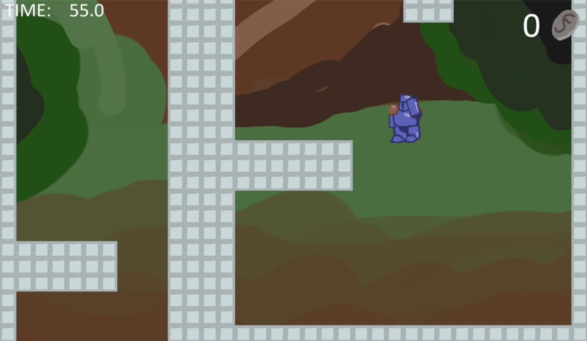
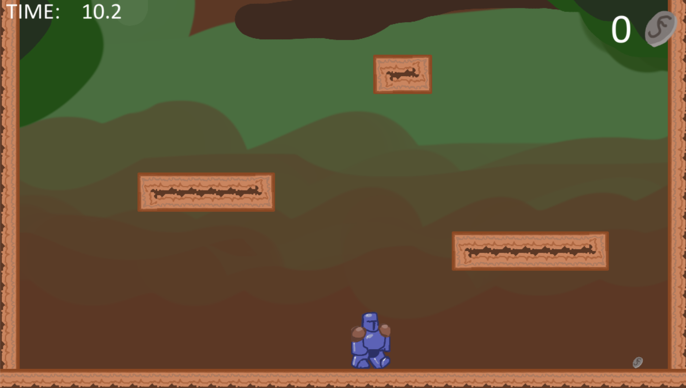
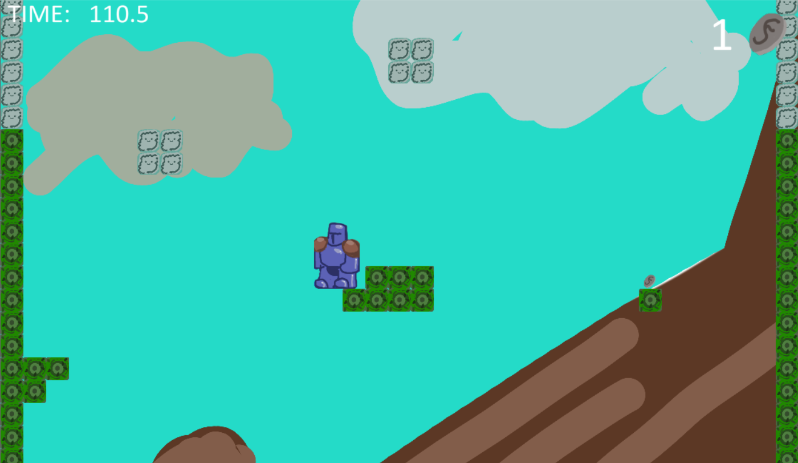
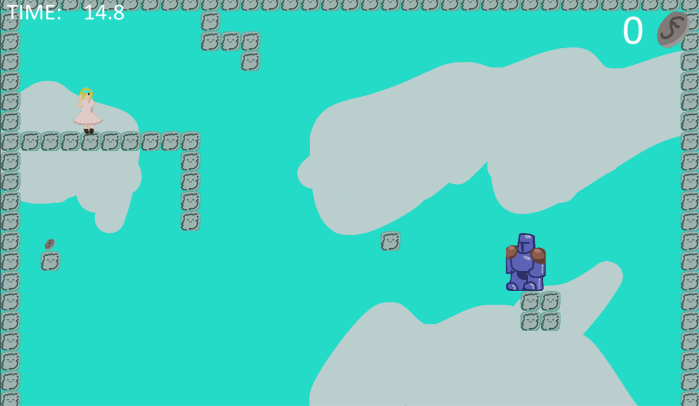

# Jump Knight
## Author: Adrian Sobczak

### Short description
Jump Knght is a game inspired on Jump King. My version features similar mechanics as the original. Most of the graphics and sound are made by me. Hope you enjoy!

### Technologies
**Python 3.9.5** - programming language used 
**Python arcade 2.5.7** - game developing library

### How to run this app?
1. Clone the game: 
`git clone  https://github.com/Arcewirz/Jump-Knight.git Jump-Knight`
`cd Jump-Knight `
2. Install the project's development and runtime requirements:
`pip install -r requirements.txt`
3. Run the game by typing: `python main.py`

### Screenshots

